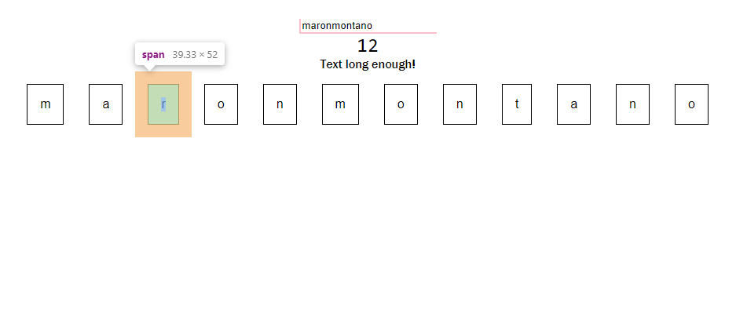
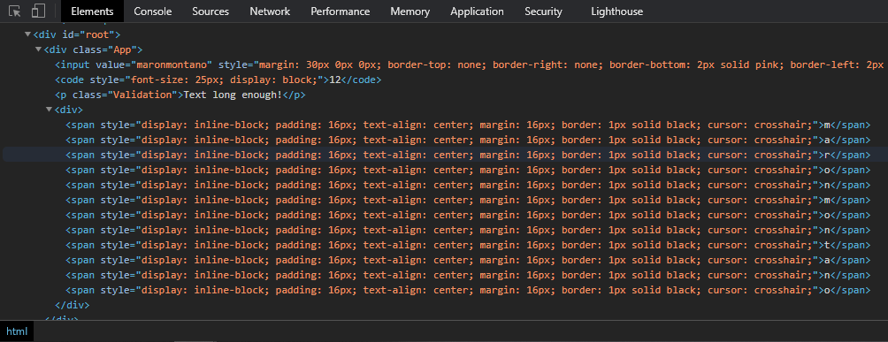

# 30 Days of React
  * **`Day 1 (12/13/20):`** Base syntax and project structure including build workflow, e.g. Babel, Webpack, Linter
  * **`Day 2 (12/14/20):`** Lists and Conditionals including `key props`

## Lab 1 - Base syntax
### Checklist
  1. Create two new **components**: UserInput and UserOutput
  1. Use `props` and `state` (pre-React 16.8, don't use React hooks yet)
  1. Pass `username` as state and apply **state management** via an event handler method
  1. Apply **two-way data binding** so `username` gets reflected always
  1. Apply CSS stylesheet and inline styling across the components

### Sample Output

### Source code
Branch: [lab-1-base-syntax](https://github.com/maronavenue/30-days-of-react/tree/lab-1-base-syntax)

## Lab 2 - Lists and Conditionals
### Checklist
  1. Create **ValidationComponent** to validate input length at length condition. Just a `stateless component`
  1. Create **CharComponent** that will hold each character of the input string as element and will be rendered as inline blocks
  1. Make use of proper `key props` for the list
  1. Handle basic `string` and `list` manipulations and also delete the element in the `state` when a **CharComponent** is clicked
  1. Play around with CSS styling and **`currying` functions**.

### Sample Output

### Source code
Branch: [lab-2-lists-and-conditionals](https://github.com/maronavenue/30-days-of-react/tree/lab-2-lists-and-conditionals)

Rest to follow